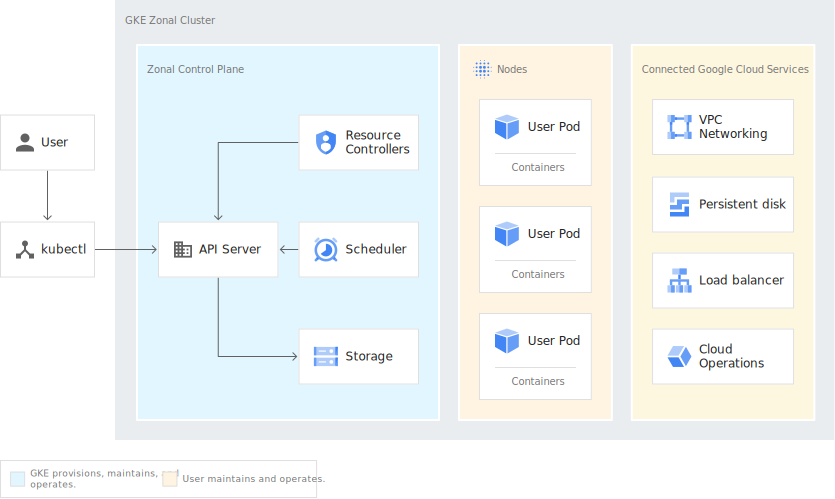

# Google Cloud Platform
Google Cloud Platform, offered by Google, is a suite of cloud computing services that runs on the same infrastructure that Google uses internally for its end-user products, such as Google Search, Gmail, Google Drive, and YouTube.

## Standard cluster architecture


source: https://cloud.google.com/kubernetes-engine/docs/concepts/cluster-architecture

## Google Cloud CLI
The Google Cloud CLI is a set of tools to create and manage Google Cloud resources. You can use these tools to perform many common platform tasks from the command line or through scripts and other automation.

- Install https://cloud.google.com/sdk/docs/downloads-interactive

### Usage
```sh
# get the versions
gcloud --version

# list available components
gcloud components list

# install a component
gcloud components install <COMPONENTS>

# lists credentialed accounts 
gcloud auth list

# initialize or reinitialize gcloud 
gcloud init

# install a kubernetes cluster
gcloud container clusters create \
  --machine-type n1-standard-2 \
  --num-nodes 2 \
  --zone <ZONE> \
   --cluster-version latest \
  <CLUSTERNAME>

# delete the cluster
gcloud container clusters delete <CLUSTERNAME>
```