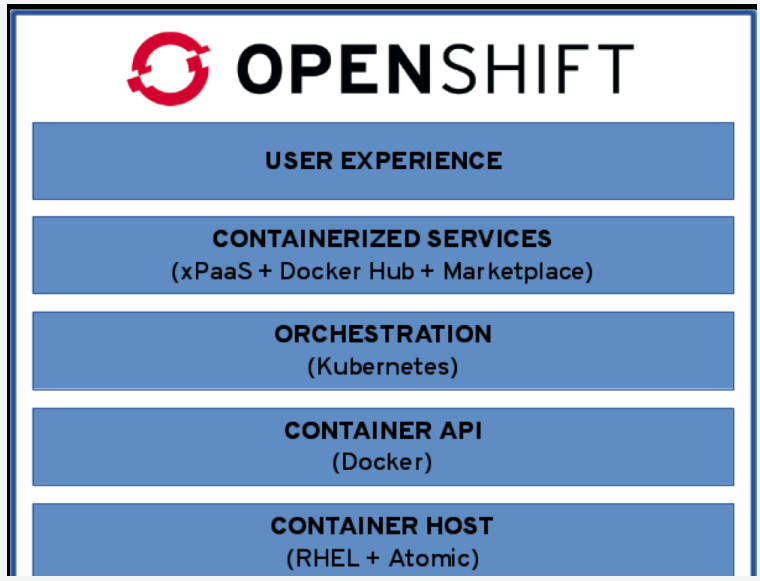

# Openshift


source: http://wiki.rockplace.co.kr/display/OP/3.+Openshift+Architecture

OpenShift is a family of containerization software products developed by Red Hat. Its flagship product is the OpenShift Container Platform — a hybrid cloud platform as a service built around Linux containers orchestrated and managed by Kubernetes on a foundation of Red Hat Enterprise Linux. Both Kubernetes and OpenShift feature robust and scalable architecture that enables rapid and large-scale application development, deployment, and management. Openshift provide a web interface, security options, build in docker image registry, template engine and minimal CI solution out of the box.

### Template engine
- yaml based
- predefined app and template catalog
- save your own template for later in the app catalog

### Build Config
- The build-in CI solution
    - git repository with dockerfile
    - predefined dockerfile

## Commands
```
# list projects (like namespaces)
oc projects

# create new project
oc new-project <my_project>

# select project
oc project <my_project>

# list pods in project
oc get pods

# list resources
oc get svc
oc get deploymentconfig
oc get build
oc get buildconfig
oc get routes
oc get pvc
oc get pv
oc get imagestream 
oc get imagestream -o yaml <image_name>

# admin related lists
oc get user
oc get identity
oc get clusterrolebindings

# add admin rights
oc adm policy add-cluster-role-to-user cluster-admin <username>


# Advanced commands

# delete pod
oc delete pod example-pod-1 -n name --grace-period=0
# force delete
oc delete pod example-pod-1 -n name --grace-period=0 --force

# diagnostic
oc adm diagnostics
oc adm diagnostics > oc_adm_diagnostics.txt

# get all routes
oc get route --all-namespaces -o wide | awk '{print $1, $3}' | grep prod | awk '{print $2}' |sort -u

# get IP-s and services
oc get service -o=wide --all-namespaces | awk '{print $1, $4, $5, $6}' | grep prod | egrep -v '<none>' | awk '{print $3,$4}'

# if namespace stuck in terminating
oc patch -n cafe-shop-dev --type=merge -p '{"metadata": {"finalizers":null}}'
```